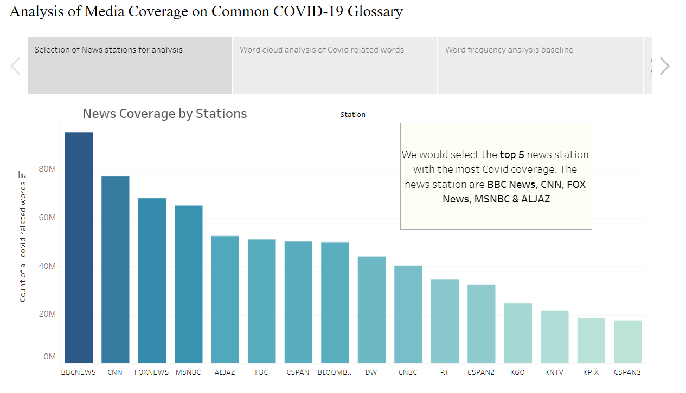
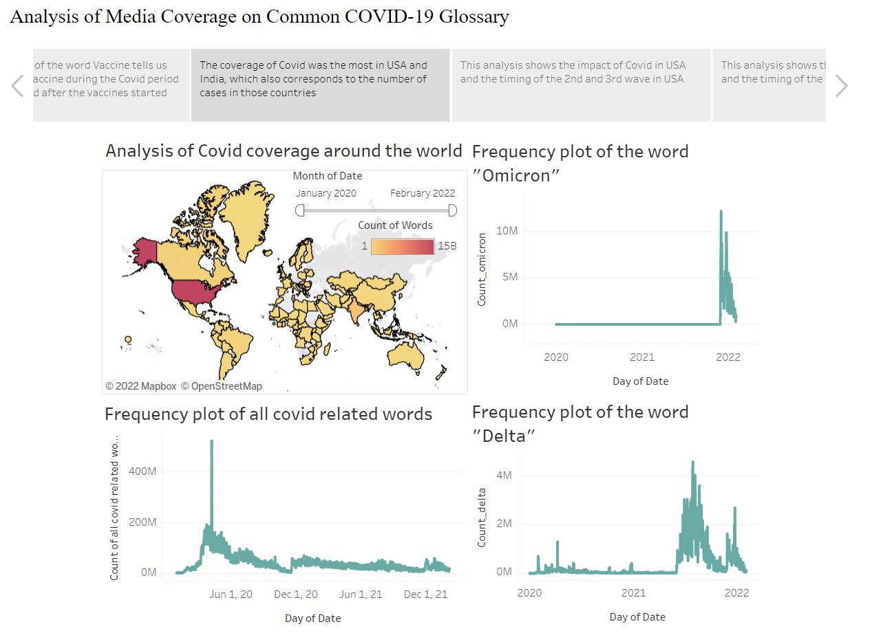

# Tableau-Dashboard---Visualizing-The-Public-Health-Narratives-Around-Covid-19

## Link to the Visualization

[https://public.tableau.com/app/profile/shardul.samdurkar/viz/CovidAnalysis](https://public.tableau.com/app/profile/shardul.samdurkar/viz/CovidAnalysis_16506336277170/Story?publish=yes)

## Glimpses of the Visualization

## About

During COVID-19, practically everyone throughout the world and in the media had varied perspectives about almost everything related to COVID, whether it was vaccine information, mask usage, mask kinds, or variants of COVID. Varied news sources gave diverse information about COVID-19, thus it's interesting to learn about the different patterns of how different news outlets disseminate particular facts to the general public. The following project uncovers trends in the distribution of various news by the media over time, as well as the impact of this news on public opinion on various themes such as social distancing, masking, vaccination hesitancy, 

